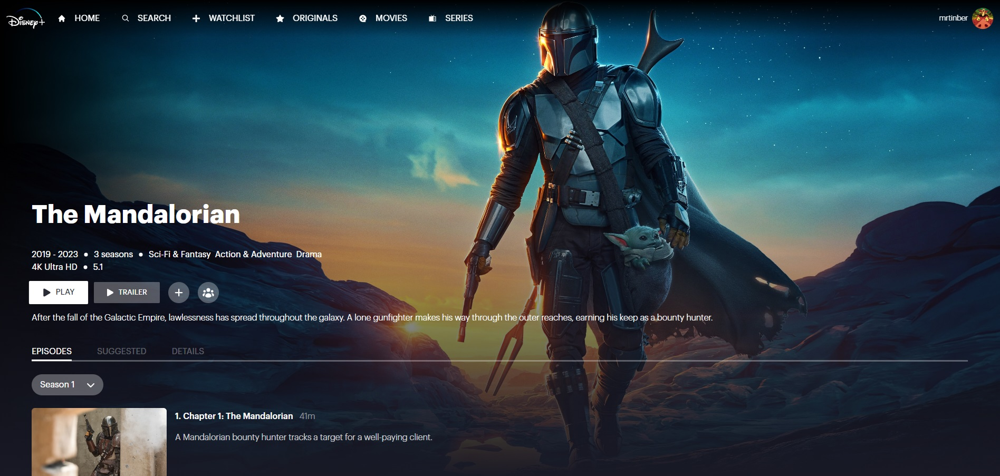

<a id="readme-top"></a>

# Disney+ Clone



## Description

This website is a clone of the popular streaming platform owned by Disney. This was made for practice.

Disclaimer:
This is a fan-made project and is not affiliated with Disney,
The Movie Database (TMDb), or any of their affiliates. All
logos, trademarks, and images are property of their respective
owners. The content and data presented on this site are for
educational and non-commercial purposes only.
© 2024 Disney, TMDb, and their related entities. All Rights
Reserved.

## Installation

First fork the project:

```bash
git clone https://github.com/mrtinber/disneyplus-clone.git
cd disneyplus-clone
```

Then run npm install:

```bash
npm install
```

And then run live server:

```bash
npm run dev
```

You should be able to view the project at http://localhost:5173

## Technologies used

![React][React.js]
![React Router][ReactRouter]
![TailwindCSS][TailwindCSS]

## Author

Kevin Bertin :

[![GitHub][GitHub]][GitHub-URL]
[![LinkedIn][LinkedIn]][LinkedIn-URL]

## Contributing

Pull requests are welcome. For major changes, please open an issue first
to discuss what you would like to change.

Please make sure to update tests as appropriate.

<p align="right">(<a href="#readme-top">back to top</a>)</p>

<!-- MARKDOWN LINKS & IMAGES -->
[React.js]: https://img.shields.io/badge/React-20232A?style=for-the-badge&logo=react&logoColor=61DAFB
[ReactRouter]: https://img.shields.io/badge/React_Router-CA4245?style=for-the-badge&logo=react-router&logoColor=white
[TailwindCSS]: https://img.shields.io/badge/Tailwind_CSS-38B2AC?style=for-the-badge&logo=tailwind-css&logoColor=white
[GitHub]: https://img.shields.io/badge/GitHub-100000?style=for-the-badge&logo=github&logoColor=white
[GitHub-URL]: https://github.com/mrtinber
[LinkedIn]: https://img.shields.io/badge/LinkedIn-0077B5?style=for-the-badge&logo=linkedin&logoColor=white
[LinkedIn-URL]: https://www.linkedin.com/in/kevin-bertin/